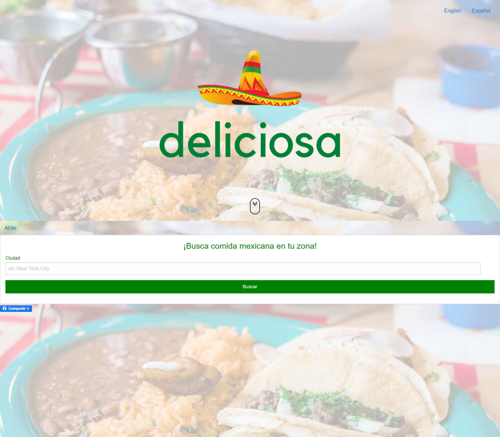
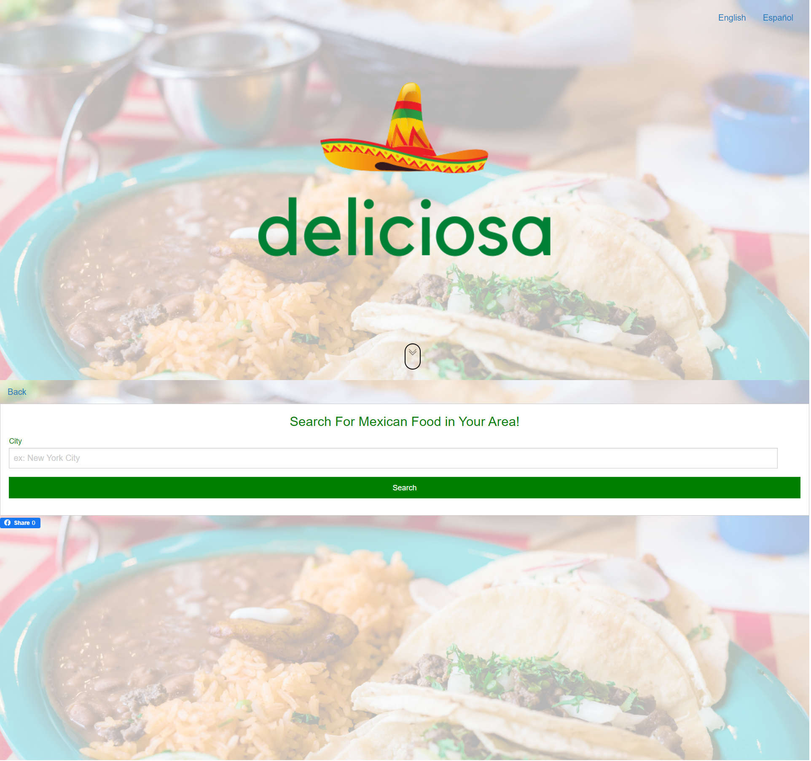

# Deliciosa

## Description 

Deliciosa is a website that allows you to find mexican cuisine in your area.

## Technologies Used

* ZURB Foundation for CSS Framework
* Facebook API for share button
* Google Places API for Autocomplete
* Zomato API for restaurant search

## Requirement Omitted 

I did not use local client-side storage. I was the only member of my group that contributed to this group project. Therefore, I started on this functionality but could not complete it. I will come back to add local client-side storage at a later time. 

[Deployed Website](https://www.google.com)

[GitHub Repository](https://www.google.com)

 

